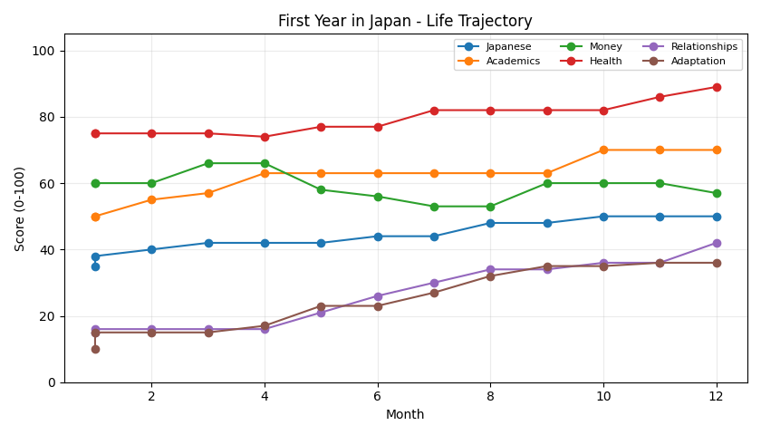

# Japan Life

[](https://github.com/lili123start/japan-life/actions/workflows/ci.yml)

**Japan Life** is a command-line life simulator for international students who have just arrived in Japan. The player experiences 12 monthly situations such as ward-office procedures, seminars, part-time work, exams, medical visits, cultural differences, and future planning. Choices change Japanese ability, academics, money, health, relationships, adaptation, and stress.

The simulation engine is deterministic and testable. AI narration is optional: if an OpenAI API key is available, the same game state is rewritten as a short Japanese interactive scene. Without a key or network connection, the built-in story is used automatically.



## Quick start

Requirements: Python 3.12+ and [uv](https://docs.astral.sh/uv/).

```bash
git clone https://github.com/lili123start/japan-life.git
cd japan-life
uv sync
uv run japan-life demo
```

Interactive play:

```bash
uv run japan-life play
```

AI narration (optional): set `OPENAI_API_KEY` in your shell, then run:

```bash
uv run japan-life play --ai --level N3
```

Do **not** save an API key in the repository. `.env` files are ignored by Git.

## Main commands

```bash
uv run japan-life play                 # 12-month interactive game
uv run japan-life demo                 # reproducible non-interactive example
uv run japan-life validate             # compare three decision strategies
```

`play` saves a CSV history and a vector PDF trajectory. `validate` generates a reproducible strategy-comparison figure and CSV data.

## Development

```bash
uv sync
uv run mypy src/
uv run pytest
uv run python -m doctest src/japan_life/utils.py
```

Dependencies are declared in `pyproject.toml` and pinned by `uv.lock`, so another machine can reproduce the environment with `uv sync`.

## Design

- `engine.py`: deterministic state transitions and endings
- `events.py`: 12 study-abroad events and fixed choices
- `story.py`: optional AI narration with offline fallback
- `storage.py`: pandas-based CSV history
- `plotting.py`: Matplotlib life trajectory
- `validation.py`: reproducible comparison of decision strategies

The AI layer never decides numeric effects, so core rules remain reproducible and unit-testable.

## License

MIT License. See [LICENSE](LICENSE).
